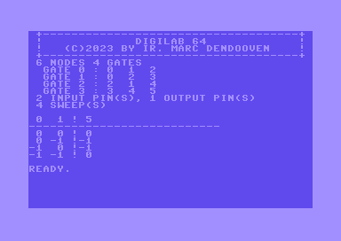

# digilab-64
a minimal logic simulator for the commodore 64
---

---
# manual

This program simulates a logic circuit. Only two input NAND gates are available. When the outputs of two different NANDs are connected to the same node, they behave as an wired OR. (untested)  
The program uses c64 BASIC boolean values: -1 for TRUE and 0 for FALSE.

# instructions

Draw your circuit on a piece of paper. Suppose there are n nodes and g gates.  

- number the gates from 0 to g-1  
- number the nodes from 0 to n-1 (including input and output pins)  
- start numbering with the input pins  
- end numbering with the output pins  
- every gate has 2 input leads (a and b) and one output pin (c)  

Now you can fill in the data section (starting at line 1000) of the program:  
This example simulates an XOR from 4 NANDS  

- first enter the number of nodes and gates
- then enter for each gate the nodes coresponding with a,b and c
- then enter the number of input and output pins
- the number of sweeps
- for each sweep the boolean values for the input pins
- run the program 

```basic
1000 rem *** fill in your data here ***
1010 rem #nodes, #gates
1020 data 6,4
1030 rem for each gate enter a,b,c
1040 data 0,1,2
1042 data 0,2,3
1043 data 2,1,4
1045 data 3,4,5
1050 rem enter #input and #output pins
1060 data 2,1
1070 rem enter #sweeps
1080 data 4
1100 rem enter values of input pins for each sweep
1110 data 0,0
1120 data 0,-1
1130 data -1,0
1140 data -1,-1
```


